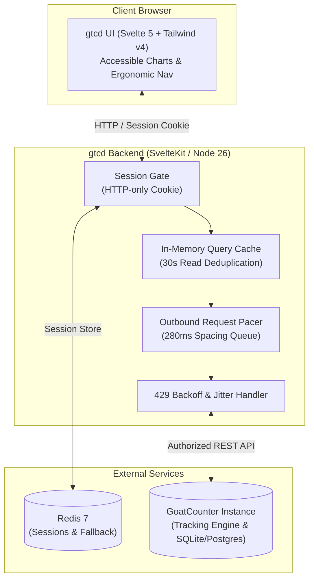
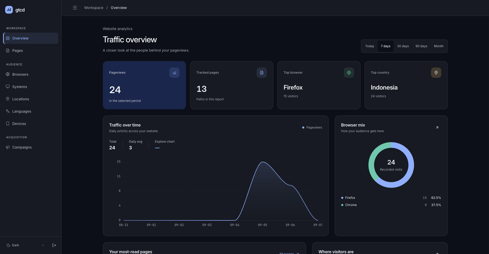
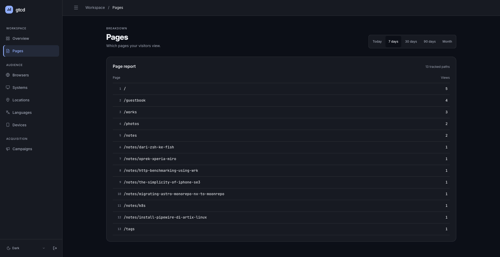
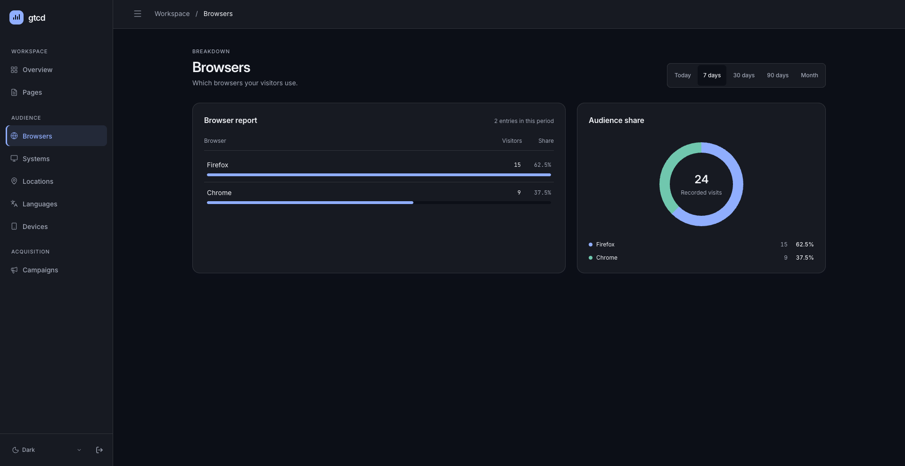
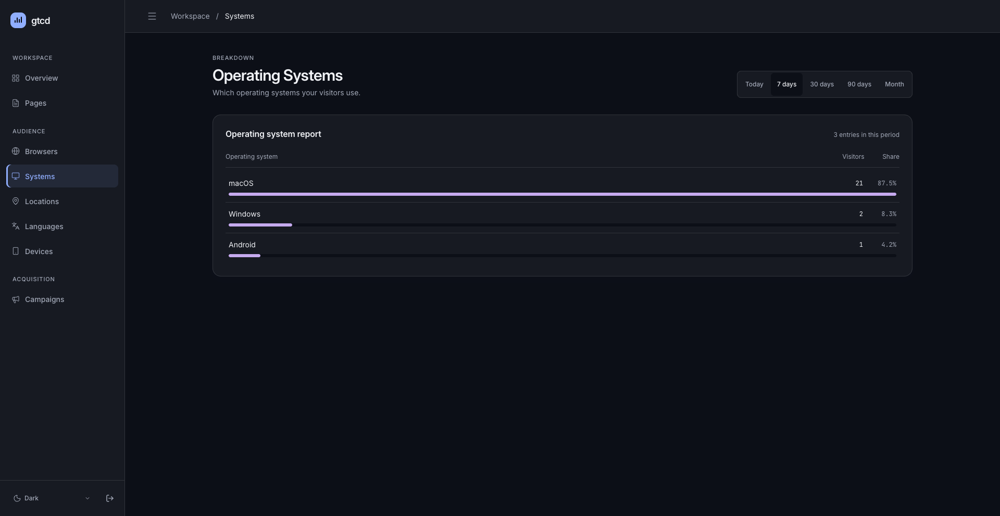
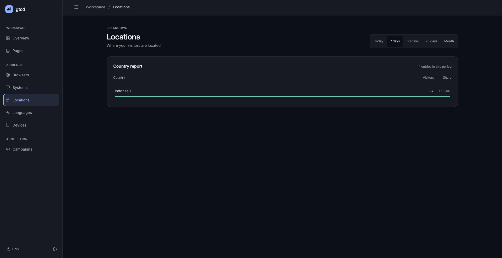
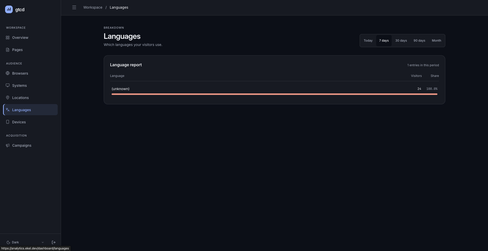
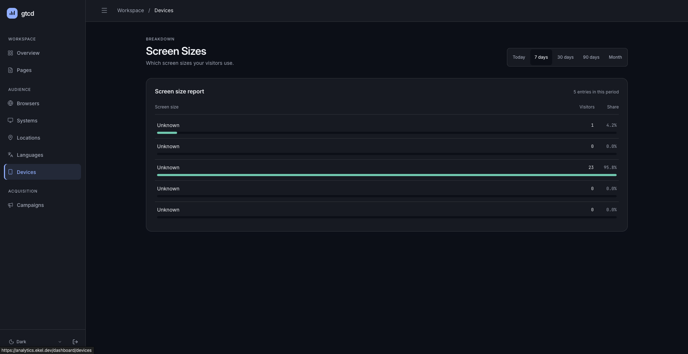
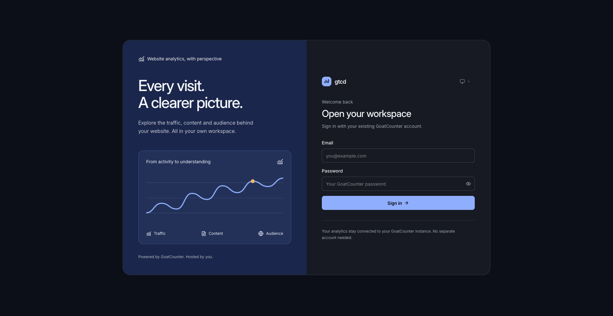

# 🐐 gtcd — Modern Web Dashboard for GoatCounter

[](https://kit.svelte.dev/)
[](https://svelte.dev/)
[](https://www.typescriptlang.org/)
[](https://tailwindcss.com/)
[](https://daisyui.com/)
[](https://www.docker.com/)
[](LICENSE)

A fast, responsive, and customizable self-hosted web dashboard for [GoatCounter](https://www.goatcounter.com/) analytics. Built with **Svelte 5 Runes**, **Tailwind CSS v4**, and **DaisyUI v5**.

---

## 💡 What is gtcd?

[GoatCounter](https://github.com/arp242/goatcounter) is an incredible privacy-friendly web analytics platform: it is lightweight, tracks page views without invasive cookies or GDPR consent popups, and is very easy to self-host.

**`gtcd` is a custom frontend dashboard for your GoatCounter instance.** It connects to your GoatCounter server via its REST API and provides an alternative, modern web UI with:

- **Svelte 5 Runes**: Fast, reactive client-side navigation with zero bundle bloat.
- **Curated Dark & Light Modes**: Clean UI built on DaisyUI v5 and Tailwind CSS v4 design tokens.
- **Power-User Ergonomics**: Collapsible desktop sidebar with `Cmd+B` / `Ctrl+B` toggle, mobile drawer, and date-range presets (Today, 7d, 30d, 90d, This Month).
- **Safe Server-Side API Mediation**: The browser never sees your `GOATCOUNTER_API_KEY`. Authentication uses HTTP-only session cookies validated against your GoatCounter login. Docker Compose passes `PROTOCOL_HEADER`/`HOST_HEADER`, so CSRF origin checks and cookie flags derive from the reverse proxy's request headers.
- **Zero Third-Party Requests**: Fonts are self-hosted; the dashboard makes no calls to external CDNs, so visitor IPs never leak to third parties and it works fully offline.
- **Upstream Rate-Limit Protection**: An outbound queue pacer (280ms spacing), exponential backoff with jitter, and a 30s query cache prevent `429 Too Many Requests` errors from GoatCounter's 4 req/sec limit.
- **Resilient Session Store**: Distributed Redis session layer with automatic fallback to an in-memory store if Redis is unavailable.
- **Accessible Visualizations (WCAG 2.1 AA)**: Interactive charts with SVG `<title>`, `<desc>`, semantic `role="meter"`, high-contrast focus rings, and screen-reader accessible data tables.
- **Installable PWA**: Web app manifest, service worker with auto-update, and offline-cached app assets — installable from the browser address bar.
- **Client-Side Caching (TanStack Query)**: Date-range switches on the dashboard are cached and refreshed in the background without full page reloads.

---

## 🏗️ Architecture

`gtcd` acts as a secure presentation and caching layer in front of your GoatCounter instance:



---

## 📊 Features & Views

- **Overview Dashboard**: Instant KPIs (total visitors, total pageviews) and an interactive SVG traffic time-series chart with date-range filters.
- **Top Content & Pages**: List of tracked paths with visitor counts, percentage bars, search filtering, and per-path drill-downs.
- **Referrer Attribution**: Per-page breakdown of referring domains and external links.
- **Client Telemetry**:
  - **Browsers**: Browser breakdown with version drill-downs.
  - **Operating Systems**: OS distribution with version drill-downs.
  - **Devices & Sizes**: Screen resolutions and device classification.
- **Audience Geography & Localization**:
  - **Locations**: Visitor distribution by country and region.
  - **Languages**: Browser locale and language breakdown.
- **Campaign Tracking**: Monitor marketing campaigns via URL query parameters.
- **Data Normalization**: Empty or null metric names are automatically normalized to `"Unknown"` for clean chart display.

---

## 🖼️ Screenshots

### Traffic overview



### Analytics reports

<table>
  <tr>
    <td></td>
    <td></td>
  </tr>
  <tr>
    <td></td>
    <td></td>
  </tr>
  <tr>
    <td></td>
    <td></td>
  </tr>
</table>

### Sign in



---

## 🚀 Quickstart

### 1. Run with Docker Compose (Easiest)

The fastest way to spin up the whole stack (Caddy + GoatCounter + Redis + `gtcd`):

```bash
# Clone the repository
git clone https://github.com/haikelz/gtcd.git
cd gtcd

# Run the automated setup script
./scripts/setup.sh
```

The setup script will:

1. Ask for your domain (`localhost` for dev, `analytics.example.com` for production)
2. Prompt for your GoatCounter admin email and password
3. Create the GoatCounter site and admin user
4. Generate an API token with all permissions
5. Generate a Caddyfile for reverse proxying
6. Save all credentials to `.env`
7. Start the full stack

**Or manually:**

```bash
cp .env.example .env
# Edit .env with your credentials and domain
nano .env
docker compose up -d --build
```

Services will be accessible at:

- **gtcd Dashboard**: `https://localhost` (Caddy redirects HTTP and uses a locally-issued certificate — trust it once in your browser; or `https://analytics.example.com` for production)
- **Tracking Endpoint**: `https://localhost/count` (or `https://analytics.example.com/count`)
- **GoatCounter**: internal only — reachable from the other containers at `http://goatcounter:8080`, not exposed on the host
- **Health Check**: `http://localhost/api/health`

#### Custom Domain Setup

For production, point your DNS A record to your server and run:

```bash
./scripts/setup.sh
# Enter: analytics.example.com
# Caddy will auto-provision TLS certificates via Let's Encrypt
```

Add the tracking snippet to your website:

```html
<script
  data-goatcounter="https://analytics.example.com/count"
  async
  src="//gc.zgo.at/count.js"
></script>
```

---

### 2. Local Bare-Metal Development

Requirements: Node.js 22+ and [pnpm](https://pnpm.io/) 9+ (the Docker image runs `node:26-alpine`).

```bash
# Install dependencies
pnpm install

# Set up local .env
cp .env.example .env

# Run development server with hot-reload
pnpm dev

# Run TypeScript & Svelte type checking
pnpm check

# Production build
pnpm build
```

---

### 3. Self-Hosting with Kubernetes

Production manifests live in [`k8s/`](k8s/) as envsubst-templated YAML applied by a single script (no Kustomize):

```bash
# 1. Create the deploy configuration from the example
cp k8s/gtcd/.env.example k8s/.env
# Edit k8s/.env with DOMAIN, EMAIL, IMAGE, GOATCOUNTER_URL, GOATCOUNTER_API_KEY,
# and optional GTCD_ADMIN_EMAILS / GOATCOUNTER_ADMIN_URL values.

# 2. Deploy (requires kubectl and envsubst)
k8s/deploy-k8s.sh
```

The script renders the manifests with envsubst, creates the `gtcd-env` Secret
from your env values, applies GoatCounter + gtcd + Redis in dependency order,
and rolls the deployment so pods pick up the current Secret.

The Kubernetes setup features:

- GoatCounter + gtcd + Redis deployed together
- Ingress routes `/count` to GoatCounter and `/` to gtcd
- Non-root hardened containers (numeric UID 1000, dropped capabilities, read-only root filesystem, `RuntimeDefault` seccomp)
- Health and readiness probes wired to `/api/health`
- Traefik Ingress with automatic Let's Encrypt TLS; application security headers
- PersistentVolumeClaim for GoatCounter data
- Session credentials delivered through a kubectl-created Secret (`gtcd-env`)

If cert-manager is absent, the ClusterIssuer step is skipped with a warning. The
Ingress does not reference optional Traefik Middleware, so an unavailable
Middleware CRD cannot make Traefik return 404 for every GTCD route.

After the first deploy, bootstrap GoatCounter (site + API token) and put the
token in `k8s/.env` as `GOATCOUNTER_API_KEY`, then re-run `k8s/deploy-k8s.sh` —
the exact commands are documented in [`k8s/gtcd/.env.example`](k8s/gtcd/.env.example).

Add the tracking snippet to your website:

```html
<script
  data-goatcounter="https://<DOMAIN>/count"
  async
  src="//gc.zgo.at/count.js"
></script>
```

---

## ⚙️ Environment Variables

Configure these in your `.env` file or container environment:

| Variable                | Required | Default                   | Purpose                                                                                                                                                                         |
| :---------------------- | :------: | :------------------------ | :------------------------------------------------------------------------------------------------------------------------------------------------------------------------------ |
| `DOMAIN`                |    No    | `localhost`               | Custom domain for your dashboard (e.g., `analytics.example.com`)                                                                                                                |
| `GOATCOUNTER_URL`       | **Yes**  | `http://goatcounter:8080` | URL of your GoatCounter instance                                                                                                                                                |
| `GOATCOUNTER_API_KEY`   | **Yes**  | —                         | GoatCounter API token (auto-generated by the setup script with full permission bits, which the stats API requires)                                                              |
| `REDIS_URL`             |    No    | `redis://redis:6379`      | Redis connection for session storage                                                                                                                                            |
| `PORT`                  |    No    | `3000`                    | Port for the Node.js server to listen on                                                                                                                                        |
| `NODE_ENV`              |    No    | `production`              | Environment mode                                                                                                                                                                |
| `COOKIE_SECURE`         |    No    | auto                      | Force the session cookie's `Secure` flag (`true`/`false`). By default it is set automatically from the request protocol, including `X-Forwarded-Proto` behind reverse proxies.  |
| `GTCD_ADMIN_EMAILS`     |    No    | —                         | Comma-separated emails permitted to manage sites and exports in gtcd.                                                                                                           |
| `GOATCOUNTER_ADMIN_URL` |    No    | —                         | Public HTTPS GoatCounter administration URL for users, API tokens, TOTP, imports, page management, dashboard preferences, and email reports. HTTP is allowed only on localhost. |

The login session cookie is `HttpOnly`, `SameSite=Lax`, and its `Secure` flag
follows the protocol the client actually used, so both `http://localhost`
development stacks and TLS production domains work without configuration.

---

## 🔒 How Authentication Works

`gtcd` separates user authentication from API access:

1. **User Login**: Users sign in on `/login` with their GoatCounter account email and password. `gtcd` verifies the credentials against GoatCounter's `/user/requestlogin` endpoint.
2. **Session Creation**: On success, `gtcd` issues an HTTP-only, `SameSite=Lax` session cookie (protocol-aware `Secure` flag) and stores the session in Redis (or in-memory fallback).
3. **API Access**: All dashboard requests are made server-side using the `GOATCOUNTER_API_KEY` defined in the environment. Your API key is never leaked to the browser.

---

## ♿ Accessibility (WCAG 2.1 AA)

- **Keyboard Navigation**: Full keyboard tab order, skip link (`<a href="#main-content">`), and `Cmd+B` / `Ctrl+B` sidebar toggle.
- **Charts & Screen Readers**: Area and bar charts include accessible SVG `<title>`, `<desc>`, and hidden fallback tables (`.sr-only`) for screen-reader users.
- **Controls**: Theme toggles and date-range pickers use standard `role="radiogroup"` with keyboard arrow navigation.
- **Reduced Motion**: All animations and transitions respect `prefers-reduced-motion: reduce`.

---

## 🤝 Contributing

Contributions, bug reports, and suggestions are welcome!

1. Fork the repo and create your branch: `git checkout -b feature/cool-idea`.
2. Ensure types and checks pass: `pnpm check && pnpm build`.
3. Commit your changes and open a Pull Request.

---

## 🙏 Acknowledgements

- [Martin Tournoij (arp242)](https://github.com/arp242) for creating [GoatCounter](https://github.com/arp242/goatcounter) — a true gem in the open-source privacy analytics space.
- The [SvelteKit](https://kit.svelte.dev/) and [DaisyUI](https://daisyui.com/) teams for fantastic tooling.

---

## 📄 License

[MIT](LICENSE) © 2026 Haikel
