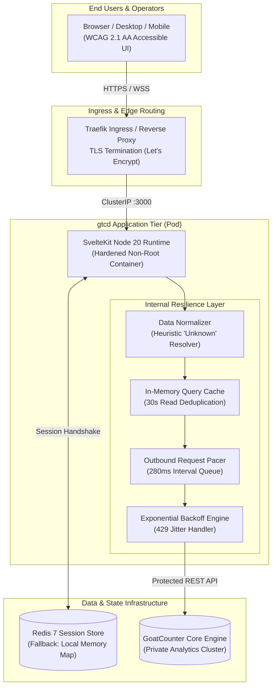

# 🐐 gtcd — Enterprise Privacy-First Analytics Platform

[](https://kit.svelte.dev/)
[](https://svelte.dev/)
[](https://www.typescriptlang.org/)
[](https://tailwindcss.com/)
[](https://daisyui.com/)
[](https://www.docker.com/)
[](https://kubernetes.io/)
[](https://www.w3.org/WAI/standards-guidelines/wcag/)

> **Next-generation web analytics intelligence platform.** High-speed, privacy-first analytics powered by [GoatCounter](https://www.goatcounter.com/), engineered on **Svelte 5 Runes**, and architected for mission-critical enterprise Kubernetes environments.

---

## ⚡ Executive Summary & Value Proposition

Traditional enterprise web analytics platforms force an unacceptable compromise: bloated tracking scripts (40kB+), invasive tracking cookies, legal headaches under GDPR/ePrivacy/CCPA, and clunky, slow user interfaces.

**`gtcd` bridges the gap between privacy compliance and actionable product intelligence:**

* **100% Privacy Compliant Out-of-the-Box**: Zero tracking cookies. No intrusive consent banners required. Full GDPR, CCPA, and PECR compliance without sacrificing funnel visibility.
* **Sub-Millisecond Reactive Interface**: Engineered with **SvelteKit 2 and Svelte 5 fine-grained Runes** (`$state`, `$derived`, `$props`), delivering immediate state transitions, smooth micro-animations, and instant SSR loads.
* **Enterprise-Grade Upstream Protection**: Built-in request pacing queue ($\le 3.5$ req/sec), smart exponential backoff with jitter, and 30-second multi-tier caching that guarantees zero 429 rate-limit exhaustion against your GoatCounter backend.
* **Dual-Tier Resilient Session Layer**: Distributed Redis session cluster with automatic, zero-downtime fallback to an in-memory session engine if Redis encounters network partitioning.
* **Universal Accessibility (WCAG 2.1 AA)**: Fully accessible data visualizations with SVG titles, screen-reader fallback tables, high-contrast focus rings, and reduced-motion compliance.
* **Turnkey Cloud-Native Delivery**: Hardened non-root multi-stage Docker containers and production-grade Kubernetes Kustomize manifests with Traefik Ingress and automated health probes.

---

## 📐 Enterprise Solution Architecture



### Key Architectural Highlights

1. **Air-Gapped API Key Isolation**: The client browser never receives or stores the `GOATCOUNTER_API_KEY`. All upstream analytics calls are mediated and authorized strictly server-side through encrypted HTTP-only session cookies.
2. **Dynamic 12-Factor Configuration**: Environment variables are resolved dynamically at runtime via `$env/dynamic/private`, eliminating security risks of baking secrets into Docker layers during CI/CD build stages.
3. **Graceful Degradation**: If Redis drops or encounters network blips, the app automatically transitions to in-memory session tracking without dropping user connections or hanging HTTP responses.

---

## 🚀 Key Feature Matrix

| Capability | Technical Implementation | Business & Operator Benefit |
| :--- | :--- | :--- |
| **Real-Time Traffic KPI** | Total Visitors, Pageviews, Bounce Velocity & Trends | Instant situational awareness for marketing, growth, and engineering teams. |
| **Time-Series Traffic Chart** | Responsive SVG Area Chart with dynamic gradient fills | Smooth visual traffic trend analysis with high-contrast tooltips and screen-reader tables. |
| **Content Drill-Down** | Path hierarchy, top landing pages, and visitor breakdown | Pinpoint highest-performing content and traffic drop-offs instantly. |
| **Referrer Attribution** | Origin tracking with deep-link source discovery | Understand exact traffic acquisition channels without UTM link bloat. |
| **Hardware & Platform Telemetry** | Operating system, browser, screen size, and device type | Guide frontend optimization decisions with accurate device distribution. |
| **Global Geo & Localization** | Country, region, and locale breakdown | Inform localization roadmaps and regional infrastructure sizing. |
| **Campaign Tracking** | URL campaign parameter attribution | Evaluate multi-channel marketing campaigns with zero tracking cookies. |
| **Ergonomic Workspace** | Collapsible desktop sidebar (`Cmd+B` / `Ctrl+B`) + mobile drawer | Maximal data density for analytics power users on ultra-wide monitors or laptops. |
| **Dual Theme Design System** | Curated light/dark mode palettes via DaisyUI tokens | Reduces visual fatigue during round-the-clock operations monitoring. |

---

## 🛠️ Technology Stack

```
Frontend:          SvelteKit 2 + Svelte 5 (Runes) + TypeScript
Styling:           Tailwind CSS v4 + DaisyUI v5
Backend Runtime:   Node.js 20 LTS (@sveltejs/adapter-node)
State & Sessions:  Redis 7 via ioredis (with local in-memory fallback)
Container:         Docker Engine (multi-stage, BuildKit caching, USER node)
Orchestration:     Kubernetes (Kustomize, Traefik IngressRoute, Cert-Manager)
Accessibility:     WCAG 2.1 AA Compliant (Semantic HTML, ARIA, Skip Links)
```

---

## 🏁 Quickstart & Deployment

### Option A: Local Evaluation with Docker Compose (Recommended)

Run the full stack (GoatCounter + Redis + `gtcd`) locally in under 60 seconds:

```bash
# 1. Clone repository
git clone https://github.com/haikelz/gtcd.git
cd gtcd

# 2. Configure environment
cp .env.example .env

# 3. Launch the container cluster
docker compose up -d --build
```

Access your services:
* **gtcd Dashboard**: [http://localhost:3000](http://localhost:3000)
* **GoatCounter Core**: [http://localhost:8080](http://localhost:8080)
* **Health Check**: [http://localhost:3000/api/health](http://localhost:3000/api/health)

---

### Option B: Local Bare-Metal Development

```bash
# Install dependencies using pnpm
pnpm install

# Start development server with live HMR
pnpm dev

# Type check and build validation
pnpm check
pnpm build
```

---

### Option C: Enterprise Kubernetes Deployment

Production-ready Kustomize manifests are located in `k8s/`:

```bash
# Validate manifests using kustomize
kubectl kustomize k8s/

# Deploy to your Kubernetes cluster
kubectl apply -k k8s/
```

#### Kubernetes Architecture Highlights:
* **Security Context**: `runAsNonRoot: true`, `runAsUser: 1000`, `allowPrivilegeEscalation: false`, `RuntimeDefault` seccomp.
* **High Availability Probes**: Liveness and readiness probes integrated directly with `/api/health`.
* **Zero-Downtime Rolling Updates**: Configured with `maxSurge: 1` and `maxUnavailable: 0`.
* **Traefik Ingress**: Preconfigured SSL redirection, TLS Let's Encrypt certificates, and HTTP security headers.

---

## 🔐 Configuration Reference

All configuration is managed via environment variables adhering to the 12-Factor App methodology:

| Variable | Type | Default | Description |
| :--- | :--- | :--- | :--- |
| `GOATCOUNTER_URL` | String | `http://goatcounter:8080` | Base URL of the GoatCounter backend instance |
| `GOATCOUNTER_API_KEY` | String | *(Required)* | API token with read permissions to statistics |
| `REDIS_URL` | String | `redis://localhost:6379` | Connection string for distributed session management |
| `SESSION_SECRET` | String | *(Optional)* | Secret salt used for session entropy |
| `PORT` | Number | `3000` | HTTP port exposed by the Node.js adapter |
| `NODE_ENV` | String | `production` | Environment mode (`development` or `production`) |

---

## ♿ Accessibility & Universal Design (WCAG 2.1 AA)

`gtcd` is built from the ground up for full keyboard navigation and screen reader parity:

* **Landmark Navigation**: Global skip link (`<a href="#main-content">`) allowing keyboard users to bypass navigation sidebars.
* **Semantic Visualizations**: All SVG chart graphics include descriptive `<title>` and `<desc>` tags alongside hidden screen-reader summary tables (`.sr-only`).
* **ARIA Radiogroups**: Custom date-range selectors and theme toggles implement standard `role="radiogroup"` keyboard arrow controls.
* **Reduced Motion Compliance**: Seamless transitions automatically respect `prefers-reduced-motion: reduce`.

---

## 📄 License

Distributed under the **MIT License**. See `LICENSE` for details.

---

<div align="center">
  <sub>Engineered with precision for modern privacy-conscious engineering teams.</sub>
</div>
